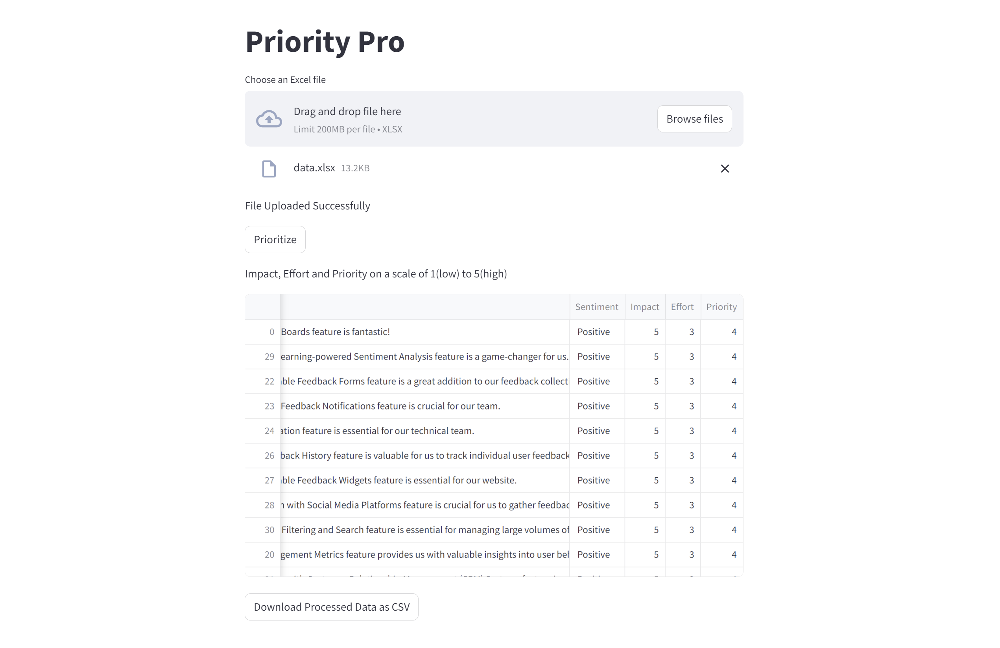

# Priority-Pro
This project involves developing a **Streamlit** application that takes an **Excel file** as input, analyzes it, and generates a priority table. 
* The **sentiment column** categorizes feedback into positive, neutral, or negative sentiments. 
* The **impact** and **effort columns** assign numerical values on a scale from 1 to 5 based on the impact and effort required for each feedback of user.
* The **priority column** is calculated based on the impact and effort values, with higher priority given to items with high impact and low effort.

Overall, the project aims to streamline the analysis of feedback data and prioritize actions based on their impact and effort.

